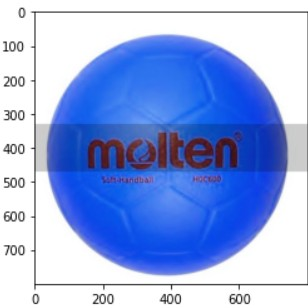
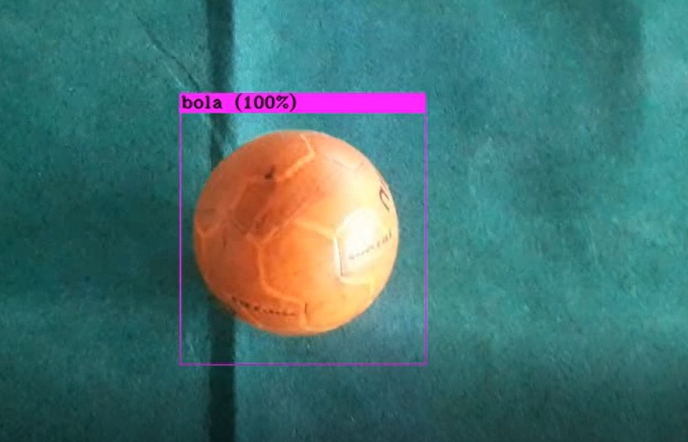
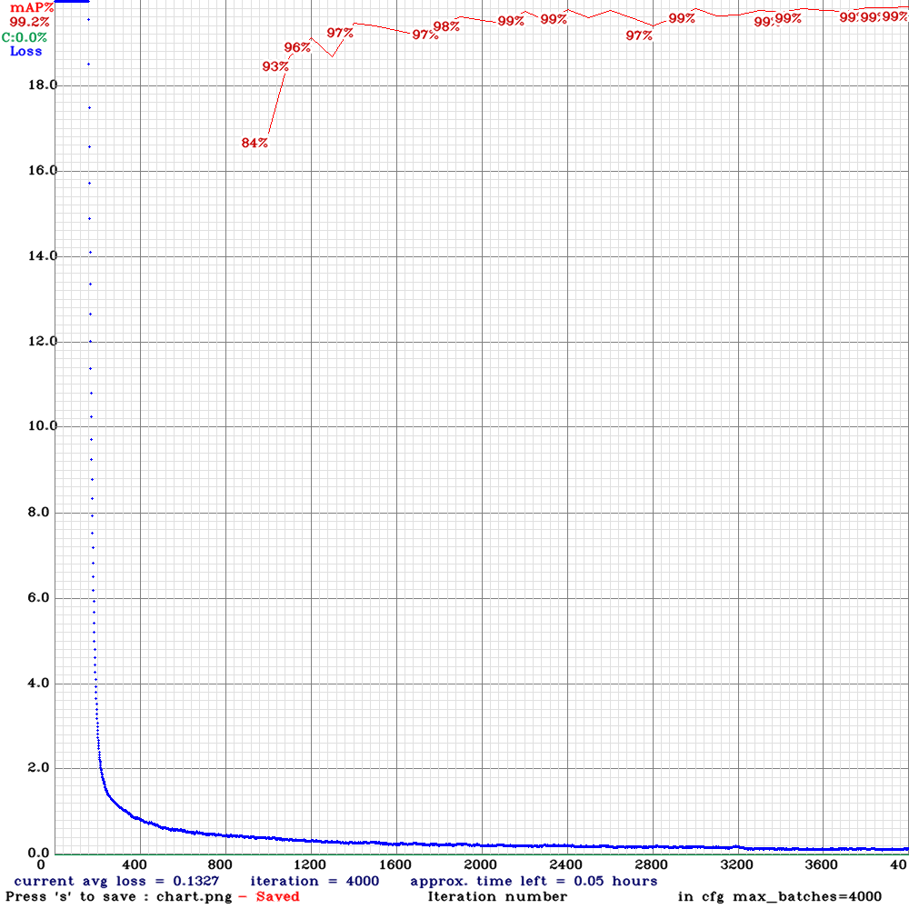

# YOLOv4-Tiny Custom Object Detection

YOLOv4 is a series of additions to computer vision techniques that are known to work with a few small novel contributions. The main contribution is to discover how all these techniques can be combined to effectively and efficiently play off one another for object detection. All of the YOLO models are object detection models. Object detection models are trained to look at an image and search for a subset of object classes. When found, these object classes are enclosed in a bounding box, and their class is identified. Object detection models are typically trained and evaluated on the COCO dataset, which contains a broad range of 80 object classes. From there, it is assumed that object detection models will generalize to new object detection tasks if they are exposed to further training data.
## Screenshots Preview

## Project Overview

The custom object detection project lasts three months, starting from April 2022. Firstly, we have to collect the orange ball datasets. Moreover, we also augmented the image datasets using the Roboflow app to increase the generalizability of our model’s performance by increasing the diversity of learning examples for our model. After we had done the image augmentation, we labelled the image dataset using Roboflow and LabelImg app. 

To train the dataset using YOLOv4, we have to configure our GPU environment on google colab. Regardless of the environment, the important things we will need to train YOLOv4 are the following : 
- GPU with specific GPU drivers installed
- OpenCV
- cuDNN configured on top of GPU drivers

Next step, we have to install the Darknet YOLOv4 training environment. Darknet is a custom framework written by Joseph Redmon. While Darknet is not as intuitive to use, it is immensely flexible and advances state-of-the-art object detection results. After installing the Darknet YOLOv4 training environment, we have to configure a custom YOLOv4 training config file for Darknet. We set up the config by combining a series of chunked config files. We take the following steps according to the [YOLOv4 repository](https://github.com/AlexeyAB/darknet):
- Set batch size to 64 - batch size is the number of images per iteration
- Established subdivisions to 12 are the number of pieces your batch is broken into for GPU memory.
- max_batches to 2000 * number of classes
- steps to 80% and 90% of max batches
- change num_classes in all of the YOLO layers
- change filters in all of the YOLO layers
Finally, we train our custom YOLOv4 object detector. Training will print after every iteration. The mAP will be calculated on the validation set and will print every 1000 iterations. We save our model weights in the backup directory and on google drive, so it is easy to re-import those weights for interference. 

## Documentation

From the chart above, The blue curve represents the training loss or the error on the training dataset (Complete Intersection-Over-Union or CIoU loss for YOLOv4). The red line represents the mean average precision (mAP) at 50% Intersection-over-Union threshold (mAP@0.5), which generalizes well on a never-before-seen dataset or validation set. For more about mAP, you can check this [link](https://jonathan-hui.medium.com/map-mean-average-precision-for-object-detection-45c121a31173 ).

## Acknowledgements

 - [YOLOv4 Neural Networks for Object Detection](https://github.com/AlexeyAB/darknet)
 - [YOLO Object Detection with OpenCV](https://pyimagesearch.com/2018/11/12/yolo-object-detection-with-opencv/)
 - [Dataset Labelling/Annotation](https://medium.com/analytics-vidhya/image-dataset-labeling-annotation-bec3390eda2d)
 - [How to Train YOLOv4 on a Custom Dataset](https://blog.roboflow.com/training-yolov4-on-a-custom-dataset/)
 - [How to use YOLOv4 OpenCV with CUDA enabled DNN Module for better performance](https://github.com/kn1ghtf1re/YOLOv4-OpenCV-CUDA-DNN)

## Authors

-  LinkedIn  - [Wiryanata Sunardi](https://www.linkedin.com/in/wiryanata/)
-  Instagram - [wiryanatasunardi](https://www.instagram.com/wiryanatasunardi/)
-  LinkedIn  - [Aidan Azkafaro Deson](https://www.linkedin.com/in/aidan-azkafaro-deson-0323221b7/)
-  Instagram - [aidanazk_](https://www.instagram.com/aidanazk_/)
